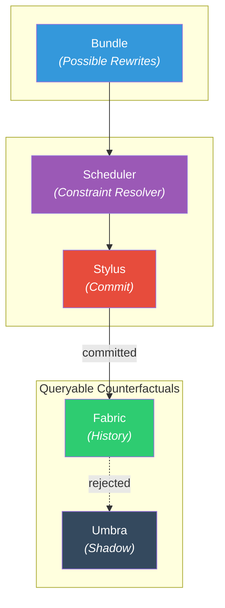

# Loom

> Minds aren't clocks. They're _looms_.

**Loom** is a history-native, deterministic computational system in which execution is woven into an immutable fabric.

Classical computing exposes only the final execution trace. The constraints, ordering decisions, and near-misses that shaped that result are discarded or overwritten. Loom makes that hidden structure explicit.

It treats computation as **the construction of history under constraint**, not just as the transformation of values.

```
THE REVΩLUTION WILL BE DETERMINISTIC
```

---

## Why Loom?

| Classical Systems | Loom |
|-------------------|------|
| `Input + Code → State Change` | `Possibilities + Constraints → Selection → History` |
| History is implicit, overwritten | History is structural, append-only |
| Debugging = printf/logs | Debugging = query the Umbra |
| Race conditions are bugs | Race conditions are impossible |
| State is primary, history derived | History is primary, state derived |

In Loom, history is not an incidental artifact of execution. **History is the product.**

---

## Core Concepts

### The Loom (Fabric)
The realized, immutable history of execution. If an event is in the Loom, it happened. Append-only.

### The Stylus (Commit)
The mechanism that performs the irreversible write. The Stylus does not calculate; it finalizes.

### The Scheduler (Constraint)  
The logic that governs when the Stylus may act. Schedulers determine which candidate trajectories are admissible. They do not write history—they constrain it.

### The Umbra (Shadow Index)
A structured archive of unrealized possibilities. When the Stylus commits to one path, valid alternatives are indexed—queryable and comparable without collapsing them into reality.

---

## Architecture

Loom is built on **WARP Graphs (Worldline Algebra for Recursive Porvenance)** with **Double-Pushout (DPO)** rewriting semantics.



### Key Properties

- **Deterministic**: Same graph + same rules = same output. Always.
- **Confluent**: Independent rewrites converge to canonical form.
- **Reversible**: Transformations preserve enough structure to reconstruct prior states.
- **Introspectable**: The Umbra makes "what could have happened" a first-class query.

---

## Getting Started

```bash
# Clone the repository
git clone https://github.com/flyingrobots/loom.git
cd loom

# Build (requires Rust 1.75+)
cargo build --release

# Run the REPL
cargo run --bin loom-repl

# Run tests
cargo test
```

### Example: Hello, Loom

```rust
use loom::{Fabric, Scheduler, Stylus};

fn main() {
    // Initialize empty fabric
    let mut fabric = Fabric::new();
    
    // Define a simple rewrite rule
    let rule = rule! {
        // Left-hand side (pattern to match)
        L: (node A) -> (node B),
        // Right-hand side (replacement)
        R: (node A) -> (node C) -> (node B),
    };
    
    // Create scheduler with the rule
    let scheduler = Scheduler::new(vec![rule]);
    
    // Create stylus bound to fabric
    let mut stylus = Stylus::new(&mut fabric);
    
    // Tick: enumerate possibilities, select, commit
    let tick_result = scheduler.tick(&mut stylus);
    
    // Query what happened
    println!("Committed: {:?}", tick_result.committed);
    
    // Query what could have happened
    println!("Umbra: {:?}", fabric.umbra().query_all());
}
```

---

## Project Status

| Component | Status |
|-----------|--------|
| Core rewriting engine | ✅ Stable |
| Scheduler | ✅ Stable |
| Umbra index | 🔨 In progress |
| WASM bindings | 🔨 In progress |
| Documentation | 📝 Drafting |

---

## History

This project was previously known as **JITOS**. The name changed when the architecture converged on its true form: a machine that orders threads to weave the fabric of reality.

JITOS served its purpose. **Loom** is the name that fits.

---

## Part of AIΩN

Loom is the execution model for [AIΩN](https://github.com/flyingrobots/aion)—a unified, deterministic computational framework where history is the primary artifact and state is merely a derived view.

The mathematical foundations are detailed in the **AIΩN Foundations Series**:

---

## License

[Apache 2.0](./LICENSE) — Use it, fork it, ship it.

---

<p align="center">
  <strong>THE REVOLUTION WILL BE DETERMINISTIC</strong>
</p>
