# JITOS

> ***JITOS is the operating system for CΩMPUTER.***

## What is CΩMPUTER?

CΩMPUTER is a computational model based on deterministic graph rewrites applied to a Recursive Metagraph (RMG).

It operates on a "worldline"—an append-only, causal DAG where every node is holographic. This means every value in memory cryptographically encodes its entire history, from the moment of calculation back to the source code that defined it.

Because the graph is append-only and deterministic, the CΩMPUTER is a time machine. It is an immutable, auditable, tamper-evident glass box.

---

## What is JITOS?

JITOS is the operating system that manages the CΩMPUTER. It acts as a bidirectional lens between the causal graph and the observer.

### The Dual Interface

JITOS provides two distinct ways to interact with the universe, depending on who—or *what*—you are:

* **For Humans (The Projection):** JITOS materializes a view of the causal DAG that behaves exactly like a standard filesystem. Humans see files; IDEs see folders; compilers see source trees. But these are just transient projections—holograms generated on-the-fly to make the graph intelligible to human brains and legacy tools.
* **For Agents (The Reality):** AI agents bypass the projection entirely. They do not waste cycles parsing linear text files or navigating directory trees. Instead, they interact directly with the raw DAG, manipulating structure, dependencies, and provenance chains with zero serialization overhead.

### Shadow Working Sets (Execution as Branching)

JITOS replaces the traditional concept of "processes" with **Shadow Working Sets**.

Using the semantics of Git, a "process" is simply a checked-out branch of the universal graph.

* **Fork:** When you start a task, JITOS forks the current state into a Shadow Working Set (an isolated branch).
* **Compute:** As the task runs, it appends new nodes to this branch. This allows for speculative execution and parallel "universes" held in superposition.
* **Merge:** When the task completes, the branch is committed and merged back into the universal timeline.

JITOS turns the entire runtime environment into a version-controlled graph. There are no files, only projections. There is no volatility, only unmerged branches.

### Using JITOS

```mermaid
graph LR
    %% Define Styles
    classDef actorNode fill:#1a1a1a,stroke:#ffffff,stroke-width:2px,color:#fff;
    classDef osLayer fill:#004b6e,stroke:#00bfff,stroke-width:2px,stroke-dasharray: 5 5,color:#fff;
    classDef graphLayer fill:#2a0a2e,stroke:#d600ff,stroke-width:3px,color:#fff;

    subgraph OBSERVERS [" The Observers "]
        Human("👤 Human / IDE<br/>(Writes Code)"):::actorNode
        Agent("🤖 AI Agent<br/>(Optimizes Logic)"):::actorNode
    end

    subgraph JITOS [" JITOS Operating System "]
        Projection["🔮 Holographic Projection<br/>(Virtual Filesystem)"]:::osLayer
        DirectPipe["⚡ Direct Graph Access<br/>(Zero Serialization)"]:::osLayer
    end

    subgraph COMPUTER [" The Causal Graph "]
        direction TB
        Mainline[("Main Universe<br/>(Immutable History)")]:::graphLayer
        Shadow[("Shadow Working Set<br/>(Active Branch/Process)")]:::graphLayer
    end

    %% Human Flow: The Illusion
    Human <==>|"Read/Write<br/>Files"| Projection
    Projection <==>|"Translates to<br/>Graph Nodes"| Shadow

    %% AI Flow: The Reality
    Agent <==>|"Manipulates<br/>Structure"| DirectPipe
    DirectPipe <==>|"Rewrites<br/>Graph"| Shadow

    %% Lifecycle
    Mainline --"Fork (Start)"--> Shadow
    Shadow --"Merge (Commit)"--> Mainline

    %% Invisible link for layout
    Human ~~~ Agent
```

> _Top Layer (Observers): Shows the two distinct entities interacting with the system._
>
> _Middle Layer (JITOS): Shows the OS acting as a translator. The left side creates the illusion of files; the right side provides the efficiency of raw access._
> 
> _Bottom Layer (CΩMPUTER): Visualizes the "Process" not as a block of RAM, but as a Forked Branch of the universe that eventually merges back into the Mainline._

---

# **CΩMPUTER • JITOS** 
© 2025 James Ross • [Flying • Robots](https://flyingrobots.dev)
All Rights Reserved

