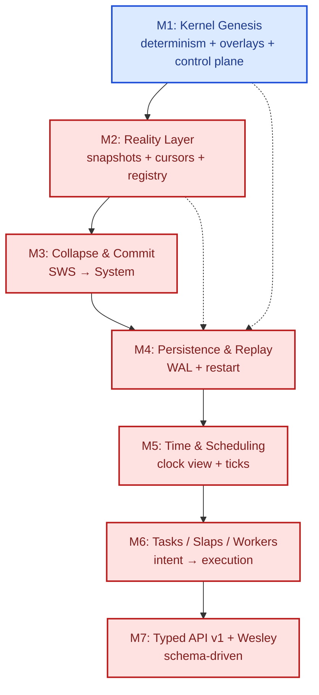

# JITOS Milestone Roadmap (MOC)

This directory contains the approval-ready milestone plans for JITOS/JITOSD. Each milestone README is intended to be executable: it defines invariants, scope, a Definition of Done, and an inline task checklist.

**How to use this roadmap**
- Treat each milestone doc as the canonical “what we are building” contract for that phase.
- When starting a milestone, freeze its remaining “contract choices” (hash/cursor formats, record schemas, etc.) *before* implementation.
- Prefer shipping irreversibles in a controlled order: snapshot semantics → collapse semantics → WAL format → time model → workers/task model → typed APIs.
- Mermaid node status coloring is derived from checklist progress; see `docs/ROADMAP/AUTOMATION.md`.

---

## Milestones

## Vision pillars (landmarks)

These are the recurring “north-star” constraints that the milestone ladder is intended to make real, one irreversible step at a time.

Normative source of truth for invariants: `docs/ARCH/ARCH-0002-architectural-invariants.md`.

**P1 — History is the system**
- authoritative record is events/rewrites (not mutable state)
- state is a derived view

**P2 — Determinism is non-negotiable**
- same inputs + same policy pins ⇒ identical replay outputs
- no ambient nondeterminism (wall clock, RNG, scheduling) leaks into truth without explicit modeling

**P3 — Speculation is default (SWS)**
- risky work happens in overlays by default
- overlays are cheap and isolated

**P4 — Collapse is transactional**
- truth changes only through explicit, deterministic collapse/commit semantics
- aborts still become observable history (at least as receipts/events)

**P5 — Observability is first-class**
- if it affects outcomes, it is queryable (why it ran, why it didn’t, what blocked it)
- operator-grade introspection is not an afterthought

### Pillars × Milestones (traceability)

This matrix is a sanity check: each milestone should make at least one pillar materially true in a new way.

Legend:
- Each cell describes the **new capability that becomes possible** (or the contract that becomes locked) for that pillar at that milestone.
- Later milestones may deepen or extend earlier capabilities, but each milestone should add at least one new “irreversible” step.

| Milestone | P1 History is the system | P2 Determinism is law | P3 SWS is default | P4 Collapse is transactional | P5 Observability is first-class |
| --- | --- | --- | --- | --- | --- |
| M1 Kernel Genesis | Append-only rewrite log (since boot) | Single-writer ordering + canonical digest surface | Create/list/discard overlays (overlay-only writes) | System immutable (collapse deferred) | `graph(view).digest` + `rewrites(...)` query |
| M2 Reality Layer | Stable `snapshotId` for views | Deterministic `first+after` cursoring | Viewer-stable view refs (System/SWS + snapshot) | Snapshot identity locks “what commit means” | Paging that doesn’t lie (snapshots + rewrites) |
| M3 Collapse & Commit | Commit boundary becomes an event | Deterministic conflict policy (fail-fast v1) | Promote overlay into truth | `collapseSws` makes System mutable (only via collapse) | Collapse receipts + conflict visibility |
| M4 Persistence & Replay | WAL becomes Chronos (authoritative order) | Restart/replay yields identical digests | (Optional) retain SWS metadata across restart | Commit boundaries persisted in WAL | Replay verification is operator-grade |
| M5 Time & Scheduling | Time derived from history (not wall clock) | Ticks are replay-stable | Time/timers operate within deterministic views | Scheduled commits/ticks become explicit | `ticks` + `now()` surfaces (subscriptions/queries) |
| M6 Tasks / Slaps / Workers | Task lifecycle becomes history | Deterministic task state transitions + receipts | `submitIntent` allocates/uses SWS contexts | Work proposes; kernel collapses (policy-driven) | `taskEvents` + worker invocation/result events |
| M7 Typed API + Wesley | Domain objects become first-class schema | Validator/codegen reduces drift | Typed SWS/process/task objects | Typed commit/collapse surfaces | Typed schema introspection + deprecation path for JSON ops |

### Proof hooks (how we know each pillar feature is real)

The table above explains “what becomes true.” This section explains **how to verify it**, in a way that can be turned into tests.

Rule of thumb:
- If it can be proven automatically, it should become a test.
- If it can’t be proven automatically yet, we still record a repeatable manual probe (GraphQL query/mutation sequence).

#### M1 — Kernel Genesis (Alpha): verification hooks

Primary gate: `docs/ROADMAP/M1-Kernel-Alpha/README.md` (Definition of Done).

- Runnable smoke script: `python3 scripts/smoke_m1_graphql.py` (expects `jitosd` already running).

- **P1 (History):** `rewrites(...)` returns an append-only, monotone `idx` sequence since boot.
  - Manual probe: apply a rewrite, then query `rewrites` twice and assert the prefix is stable and indices are ascending.
- **P2 (Determinism):** re-running the same ordered mutation script in a fresh process yields identical outputs.
  - Automated proof (required): an end-to-end test that runs the same GraphQL script twice (fresh daemon each run) and asserts identical digests + rewrite log outputs.
- **P3 (SWS):** SWS overlay isolation.
  - Manual probe: create SWS 0, apply `AddNode` to SWS 0, assert System digest unchanged and SWS digest changed.
- **P4 (Collapse):** explicitly deferred in M1.
  - Proof (required): the API surface either does not exist, or returns `NOT_IMPLEMENTED` deterministically.
- **P5 (Observability):** minimal operator-grade query surfaces exist.
  - Manual probe: `graph(view).digest`, `listSws`, `rewrites`.

Minimal GraphQL smoke sequence (illustrative):

```graphql
# 1) System digest (H0)
query { graph(view: { kind: SYSTEM }) { digest } }

# 2) Create SWS (expects "0")
mutation { createSws { sws { id } } }

# 3) Apply AddNode into SWS 0
mutation {
  applyRewrite(
    view: { kind: SWS, swsId: "0" }
    rewrite: {
      ops: [{ op: "AddNode", data: { kind: "demo", payload_b64: "aGVsbG8=" } }]
    }
  ) {
    accepted
    receipt { rewriteIdx viewDigest }
  }
}

# 4) Assert: SWS digest != H0; System digest == H0
query { graph(view: { kind: SWS, swsId: "0" }) { digest } }
query { graph(view: { kind: SYSTEM }) { digest } }

# 5) Rewrite log is ordered
query { rewrites(view: { kind: SWS, swsId: "0" }, page: { first: 100 }) { idx } }
```

#### M2 — Kernel Reality Layer (Beta-0): verification hooks

Primary gate: `docs/ROADMAP/M2-Kernel-Reality-Layer/README.md` (Definition of Done).

- **P1 (History):** snapshots become stable identifiers (`snapshotId`).
  - Automated proof: repeated `graph(view)` calls with no intervening mutations return same `snapshotId` and `digest`.
- **P2 (Determinism):** `first+after` cursoring is deterministic.
  - Automated proof: page `nodes(first=1)` then `after=<id>` and assert no duplication/missing items and stable order.
- **P5 (Observability):** paging doesn’t lie.
  - Automated proof: `rewrites(view, after)` yields stable continuation by `idx` (no gaps/duplicates).

#### M3 — Collapse & Commit (Beta-1): verification hooks

Primary gate: `docs/ROADMAP/M3-Collapse-Commit/README.md` (Definition of Done).

- **P4 (Collapse):** `collapseSws` is the only path to System mutation.
  - Automated proof: System digest changes only after successful collapse; direct System writes remain impossible.
- **P2 (Determinism):** conflict policy is deterministic (fail-fast v1).
  - Automated proof: construct a known conflicting overlay and assert `committed=false` with stable error/receipt.

#### M4 — Persistence & Replay (Beta-2): verification hooks

Primary gate: `docs/ROADMAP/M4-Persistence-Replay/README.md` (Definition of Done).

- **P1 (History):** WAL is the authoritative Chronos order.
  - Automated proof: run mutations, stop daemon, restart with same `--data-dir`, and assert digests equal the pre-restart values.
- **P2 (Determinism):** replay is stable across restart.
  - Automated proof: restart test is required (same WAL → same digests).

#### M5 — Time & Scheduling (Beta-3): verification hooks

Primary gate: `docs/ROADMAP/M5-Time-Scheduling/README.md` (Definition of Done).

- **P1 (History):** `now()` is derived from history (not wall clock).
  - Automated proof: `now()` is a pure function of the event stream/WAL.
- **P2 (Determinism):** tick loop produces replay-stable `TICK` events.
  - Automated proof: record/replay yields identical tick stream.

#### M6 — Tasks / Slaps / Workers (Beta-4): verification hooks

Primary gate: `docs/ROADMAP/M6-Tasks-Slaps-Workers/README.md` (Definition of Done).

- **P1 (History):** task lifecycle is history, not “status fields as truth.”
  - Automated proof: task state transitions are emitted as events and are replay-stable.
- **P5 (Observability):** operator can answer “why did this run / why did it fail?”
  - Automated proof: `taskEvents` includes state transitions + linkage to receipts/invocations.

#### M7 — Typed API + Wesley (1.0 runway): verification hooks

Primary gate: `docs/ROADMAP/M7-Typed-Domain-API-v1/README.md` (Definition of Done).

- **P2 (Determinism):** typed validators reduce schema drift.
  - Automated proof: codegen/validation pipeline is versioned and rejects unknown fields/kinds deterministically.
- **P5 (Observability):** typed introspection makes operator tooling safer.
  - Automated proof: GraphQL introspection shows stable domain types and deprecation path for JSON ops.

## Cross-milestone dependency DAG (high-level)

This is a milestone-level dependency graph. It is intentionally “irreversibles-first”: we lock view identity and paging before collapse, collapse before durability, durability before time/scheduling, and scheduling before tasks/workers and typed APIs.

Legend (node status):
- **In progress:** blue
- **Blocked:** red
- **Done:** green



Interpretation of edges:
- **M1 → M2:** before scaling a viewer, lock snapshot identity + deterministic cursor semantics.
- **M2 → M3:** collapse/commit needs stable “what exactly are we committing?” snapshot semantics and predictable view materialization.
- **M3 → M4:** WAL schema must persist commit boundaries and System mutation events; committing before durability avoids a “log of overlays” dead end.
- **M4 → M5:** deterministic time/ticks must be replayable; time semantics without WAL becomes a fork of reality.
- **M5 → M6:** task/work execution needs a scheduler/tick boundary and stable policy pins in receipts.
- **M6 → M7:** typed APIs and generators are only safe once the domain objects and kinds exist in practice.

The dashed edges indicate that durability (M4) can be pulled earlier if you decide “survive restart” is more urgent than collapse, but it should still follow the frozen v0 contracts from M1/M2.

### M1 — Kernel Genesis (Alpha)
- **Doc:** `docs/ROADMAP/M1-Kernel-Alpha/README.md`
- **Focus:** deterministic in-memory kernel + SWS overlays (overlay-only writes) + GraphQL control plane
- **Key outcomes:** single-writer mutation ordering, deterministic digests, strict op validation, operator-grade rewrite log
- **What you can do:**
  - run `jitosd` locally and query `graph(view) { digest }`
  - create/list/discard SWS overlays
  - apply exactly one rewrite op (`AddNode`) into an SWS overlay and receive a deterministic receipt (`rewriteIdx`, `viewDigest`)
  - query an append-only rewrite log and verify deterministic ordering
  - repeat the same mutation script in a fresh process and get identical digests/log outputs (in-memory; no persistence)

### M2 — Kernel Reality Layer (Beta-0)
- **Doc:** `docs/ROADMAP/M2-Kernel-Reality-Layer/README.md`
- **Focus:** viewer-stable snapshots, stable `snapshotId`, real `first+after` cursoring, rewrite allowlist/registry
- **Key outcomes:** paging that doesn’t lie; snapshot identity semantics locked
- **What you can do:**
  - treat `graph(view)` as a stable snapshot: get `snapshotId` and page nodes/edges deterministically with `first+after`
  - page `rewrites(view, page)` deterministically using `after` by `idx`
  - rely on a kernel-side rewrite registry (allowlist) so clients can’t drift the op format silently
  - build a viewer that can cache, diff, and paginate without “same state, different response” bugs

### M3 — Collapse & Commit (Beta-1)
- **Doc:** `docs/ROADMAP/M3-Collapse-Commit/README.md`
- **Focus:** deterministic collapse semantics (SWS → System) and explicit conflict policy
- **Key outcomes:** System mutability only via deterministic collapse; commit boundary becomes first-class
- **What you can do:**
  - collapse an SWS into System deterministically (`collapseSws`) and observe a new System digest/snapshot
  - get deterministic conflict handling (initially fail-fast) instead of implicit/accidental merge behavior
  - observe collapse/discard events in the rewrite log (commit boundary becomes visible)
  - treat System as mutable *only* through deterministic commit semantics

### M4 — Persistence & Replay (Beta-2)
- **Doc:** `docs/ROADMAP/M4-Persistence-Replay/README.md`
- **Focus:** durable append-only WAL + deterministic boot/replay + restart verification
- **Key outcomes:** restart-safe kernel; WAL schema/versioning becomes irreversible contract
- **What you can do:**
  - run `jitosd --data-dir …`, perform mutations/commits, stop and restart
  - verify restart/replay reconstructs identical System digests from the same WAL
  - use the WAL as the authoritative Chronos order (auditable, replayable history)
  - run an integration test that proves “script → restart → digests identical”

### M5 — Time & Scheduling (Beta-3)
- **Doc:** `docs/ROADMAP/M5-Time-Scheduling/README.md`
- **Focus:** deterministic time (“Clock View”), tick loop, timer primitive, policy pins in receipts/events
- **Key outcomes:** `now()` derived from history; ticks are observable and replay-stable
- **What you can do:**
  - query deterministic “now” (derived from history, not wall clock)
  - subscribe to global tick events and observe replay-stable scheduling behavior
  - run a minimal timer demo that fires deterministically and records its firing as events
  - see `policyId`/`rulePackId` pins show up consistently in receipts/events (policy boundary becomes real)

### M6 — TASKS / SLAPS / Workers (Beta-4)
- **Doc:** `docs/ROADMAP/M6-Tasks-Slaps-Workers/README.md`
- **Focus:** make work real: `submitIntent`, deterministic task lifecycle, worker invocation/results with receipts
- **Key outcomes:** job fabric becomes operational; worker boundary and capability checks become real
- **What you can do:**
  - call `submitIntent` to create a task/process/SWS context and get IDs back
  - observe deterministic task state transitions (queued → running → done/failed) via `taskEvents`
  - invoke an in-process demo worker and get auditable invocation/result events with receipts
  - start enforcing a capability boundary for worker invocation (even if localhost-only initially)

### M7 — Typed Domain API v1 + Wesley Mode (1.0 runway)
- **Doc:** `docs/ROADMAP/M7-Typed-Domain-API-v1/README.md`
- **Focus:** stop hiding behind JSON; typed schema + stable kind registries + generator skeleton
- **Key outcomes:** schema/validators/registries converge; deprecation path for JSON ops exists
- **What you can do:**
  - interact with typed Task/Slap/Primitive/Policy objects via a stable GraphQL v1 schema
  - rely on a canonical NodeKind/EdgeKind registry (versioned) instead of free-form strings everywhere
  - use a generator skeleton (“Wesley mode”) to produce Rust enums/validators from schema/registries
  - migrate away from JSON ops via an explicit deprecation path (v0 remains supported but discouraged)

---

## Continuous tracks (every milestone)

### Spec hardening
Every milestone should end with:
- what became irreversible
- spec updates/versioning for affected contracts
- golden-vector tests for hashing/digest/WAL serialization

### Tooling
A small CLI pays dividends early:
- `jitosctl graph --view system --digest`
- `jitosctl rewrites --view sws:0`
- `jitosctl replay --verify`
